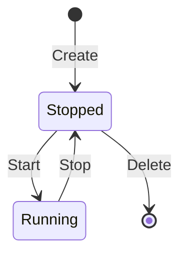

# 容器实例生命周期

## 数据结构

### 后端

```go
type Instance struct {
    // 映射的 Docker 容器唯一标识
    ContainerID string `json:"container_id"`
    // 服务端名称
    Name        string `json:"name"`
    // 当前运行态
    Status      string `json:"status"`
}
```

### 数据库

- `instances` 表字段：
- `container_id`（主键）
- `name`（唯一）
- `status`
- `created_at`

## 接口

[../api/contracts.md](../api/contracts.md)

## 状态流转



## 一致性策略

- 事实来源：Docker Daemon。
- 缓存来源：SQLite（用于实例名、状态缓存和恢复）。
- 收敛机制：`ListInstances` 周期性/调用时同步 Docker -> SQLite。

## 失败与回滚策略

- 创建流程：若数据库保存失败，立即强制删除刚创建容器。
- 启停流程：Docker 操作成功但 DB 更新失败时，接口返回错误；后续列表刷新会将状态重新收敛。
- 删除流程：Docker 删除成功后若 DB 删除失败，后续列表会因 Docker 不存在而清理状态。
