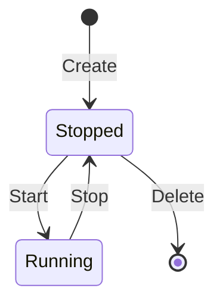

# 容器实例生命周期

## 数据结构

### 后端

```go
type Instance struct {
    // 映射的 Docker 容器唯一标识
    ContainerID string `json:"container_id"`
    // 服务端名称
    Name        string `json:"name"`
    // 来源游戏模板 ID（创建请求字段，当前版本未持久化到 instances 表）
    GameID      string `json:"game_id"`
    // 当前运行态
    Status      string `json:"status"`
}
```

### 数据库

- `instances` 表字段：
- `container_id`（主键）
- `name`（唯一）
- `status`
- `created_at`

## 接口

[../api/contracts.md](../api/contracts.md)

## 状态流转



## 创建配置注入

- 端口映射来源：模板 `container.ports`，创建容器时写入 Docker `ExposedPorts` 与 `PortBindings`。
- 卷挂载来源：模板 `container.volumes`，卷名规则为 `minedock-{instanceName}-{volumeName}`。
- 启动命令来源：若模板配置了 `container.command` 则覆盖镜像命令；否则使用镜像默认 `ENTRYPOINT/CMD`。

## 一致性策略

- 事实来源：Docker Daemon。
- 缓存来源：SQLite（用于实例名、状态缓存和恢复）。
- 收敛机制（主路径）：监听 Docker Events，在容器状态变化后通过 WebSocket 推送最新实例快照。
- 收敛机制（降级路径）：`ListInstances` 按需对账 Docker -> SQLite；当前端 WebSocket 不可用时回退到轮询接口。

## 控制台交互

- 路由：前端通过 `/instances/:id` 进入容器详情页，页面建立 `GET /api/ws/console/:id` WebSocket。
- 输入链路：浏览器 WebSocket 输入 -> 后端 ConsoleHandler -> Docker Attach stdin。
- 输出链路：Docker Attach stdout/stderr -> 后端 ConsoleHandler -> 浏览器 WebSocket -> xterm.js。
- 运行态约束：仅 Running 容器允许 Attach；容器停止后连接会断开，页面提示用户重新启动后再连接。
- TTY 差异：TTY 容器输出直接透传；非 TTY 容器需先做 stdout/stderr 解复用再推送。

## 失败与回滚策略

- 创建流程：若数据库保存失败，立即强制删除刚创建容器。
- 启停流程：Docker 操作成功但 DB 更新失败时，接口返回错误；后续列表刷新会将状态重新收敛。
- 删除流程：Docker 删除成功后若 DB 删除失败，后续列表会因 Docker 不存在而清理状态。
- 数据卷策略：删除实例不会自动清理 Docker 卷，卷数据默认保留，需手动回收或后续能力支持。
