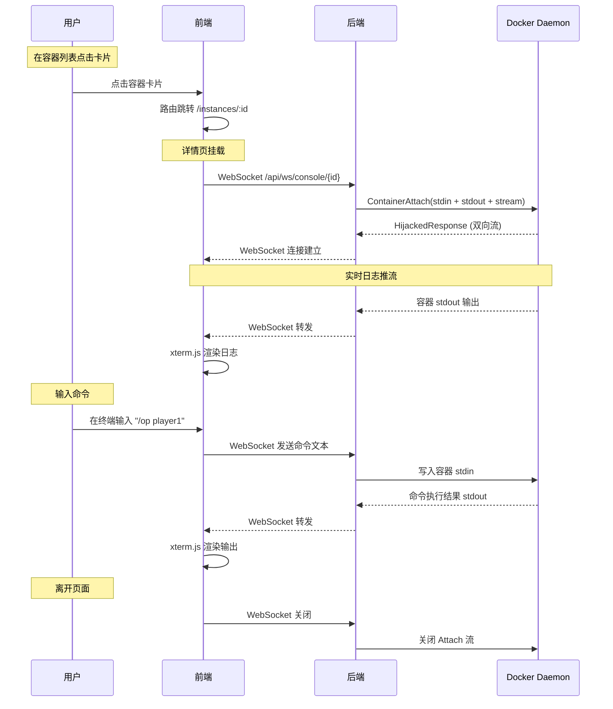

# 容器详情页 Web 控制台（实时日志 + 交互式命令）

## 背景

当前 MineDock 的容器列表页仅展示容器卡片（名称、状态、启停按钮），用户无法查看容器的实时输出日志，也无法向运行中的容器发送命令（如 Minecraft 的 `/op`、`/whitelist` 等服务器指令）。对于游戏服务器管理场景，控制台是核心运维入口。

本计划实现：

1. 点击容器卡片后进入 **容器详情页**（新路由 `/instances/:id`）
2. 详情页包含一个 **Web 终端**（基于 xterm.js），实时展示容器主进程的 stdout/stderr 输出
3. 终端下方支持 **交互式命令输入**，用户输入的内容通过 WebSocket 写入容器的 stdin
4. 后端通过 Docker SDK `ContainerAttach` 将容器的 stdin/stdout 双向桥接到 WebSocket

## 需要评审的内容

> [!IMPORTANT]
> **Attach vs Exec 方案选型**
>
> Docker 提供两种方式与容器交互：
>
> | 方案                                 | 说明                               | 适用场景                                           |
> | ------------------------------------ | ---------------------------------- | -------------------------------------------------- |
> | **ContainerAttach**                  | 连接到容器主进程的 stdin/stdout    | 游戏服务器控制台（如 Minecraft 的 server console） |
> | **ContainerExecCreate + ExecAttach** | 在容器中创建新进程（如 `/bin/sh`） | 调试、执行一次性命令                               |
>
> 本计划采用 **ContainerAttach** 方式。原因：
>
> - 游戏服务器（如 itzg/minecraft-server）的主进程本身就是服务端控制台，接受 stdin 命令
> - Attach 可以看到服务器启动以来的完整日志流，不需要二次查询历史日志
> - 无需容器内安装 shell，兼容精简镜像

> [!IMPORTANT]
> **前端终端库选型**
>
> 采用 **xterm.js**（`@xterm/xterm`），这是 VS Code 内置终端使用的库：
>
> - 支持 ANSI 转义序列（颜色、光标控制）
> - 内置 WebSocket attach addon（`@xterm/addon-attach`）
> - `@xterm/addon-fit` 自适应容器尺寸
> - NPM 生态成熟，与 Vue 3 集成简单

> [!WARNING]
> **仅运行中的容器可以 Attach**
>
> Docker `ContainerAttach` 要求容器处于 Running 状态。容器已停止时，控制台 WebSocket 改用 Docker Logs 读取历史输出并发送给前端，便于在崩溃后直接查看原因。

> [!IMPORTANT]
> **WebSocket 路径设计**
>
> 新增 WebSocket 端点 `GET /api/ws/console/{id}`，其中 `{id}` 为容器 ID。Running 容器对应一个 Docker Attach 会话，Stopped/Exited 容器对应一次 Docker Logs 读取。连接关闭时自动释放资源。
>
> 该端点与现有的 `GET /api/ws/events`（事件广播）相互独立。

## 前端交互流程



## 拟定更改

### 后端 Service 层

#### [NEW] console_service.go (`backend/internal/service/console_service.go`)

新增 `ConsoleService`，封装 Docker Attach 的双向流桥接逻辑：

```go
// ConsoleService 封装容器控制台的 Attach 逻辑。
type ConsoleService struct {
    cli *client.Client
}

// NewConsoleService 创建 ConsoleService。
func NewConsoleService(cli *client.Client) *ConsoleService { ... }

// Open 打开容器控制台会话。
// Running 容器返回 Attach 双向流，Stopped/Exited 容器返回 Docker Logs 历史输出。
func (s *ConsoleService) Open(ctx context.Context, containerID string) (*ConsoleSession, error) {
    // 1. ContainerInspect 检查容器状态和 TTY
    // 2. Running 时调用 ContainerAttach(ctx, containerID, container.AttachOptions{
    //        Stream: true,
    //        Stdin:  true,
    //        Stdout: true,
    //        Stderr: true,
    //    })
    // 3. 非 Running 时调用 ContainerLogs(ctx, containerID, LogsOptions{ShowStdout: true, ShowStderr: true})
}
```

> [!NOTE]
> `ConsoleService` 故意不依赖 `InstanceStore`。Attach 操作只需要 Docker client 和容器 ID，不涉及业务状态变更。保持职责单一。

---

### 后端 API 层

#### [NEW] console_handler.go (`backend/internal/api/console_handler.go`)

新增 WebSocket Handler，负责 HTTP → WebSocket 升级，然后在 WebSocket 和 Docker Attach 流之间做双向 pipe：

```go
// ContainerConsole 定义控制台 Handler 依赖的 Attach 能力。
type ContainerConsole interface {
    Attach(ctx context.Context, containerID string) (types.HijackedResponse, error)
}

// ConsoleHandler 暴露容器控制台 WebSocket 处理器。
type ConsoleHandler struct {
    console ContainerConsole
}

// NewConsoleHandler 创建 ConsoleHandler。
func NewConsoleHandler(c ContainerConsole) *ConsoleHandler { ... }

// HandleConsole 处理 GET /api/ws/console/{id}。
// 将 HTTP 升级为 WebSocket，然后在 WebSocket ↔ Docker Attach 之间双向转发数据。
func (h *ConsoleHandler) HandleConsole(w http.ResponseWriter, r *http.Request) {
    // 1. 解析路径中的容器 ID
    // 2. websocket.Accept() 升级连接
    // 3. 调用 console.Attach() 获取 Docker 双向流
    // 4. 启动两个 goroutine：
    //    - Docker stdout → WebSocket write（容器输出推送给前端）
    //    - WebSocket read → Docker stdin（用户输入写入容器）
    // 5. 任一方向断开时关闭另一方，清理资源
}
```

**双向桥接核心逻辑：**

```go
func (h *ConsoleHandler) bridgeLoop(ctx context.Context, conn *websocket.Conn, hijacked types.HijackedResponse) {
    defer hijacked.Close()

    done := make(chan struct{})

    // Docker stdout → WebSocket
    go func() {
        defer close(done)
        buf := make([]byte, 4096)
        for {
            n, err := hijacked.Reader.Read(buf)
            if n > 0 {
                writeCtx, cancel := context.WithTimeout(ctx, 3*time.Second)
                _ = conn.Write(writeCtx, websocket.MessageBinary, buf[:n])
                cancel()
            }
            if err != nil {
                return
            }
        }
    }()

    // WebSocket → Docker stdin
    go func() {
        for {
            _, data, err := conn.Read(ctx)
            if err != nil {
                return
            }
            _, _ = hijacked.Conn.Write(data)
        }
    }()

    <-done
}
```

#### [MODIFY] router.go (`backend/internal/api/router.go`)

- `NewRouter` 签名新增 `*ConsoleHandler` 参数
- 注册新路由：`GET /api/ws/console/{id}`（与 `/api/ws/events` 同级，跳过 CORS 中间件）

---

### 后端入口

#### [MODIFY] main.go

- 创建 `ConsoleService`，注入 Docker client
- 创建 `ConsoleHandler`，注入 `ConsoleService`
- 更新 `NewRouter` 调用

```go
consoleSvc := service.NewConsoleService(cli)
consoleHandler := api.NewConsoleHandler(consoleSvc)
router := api.NewRouter(h, gameHandler, wsHandler, consoleHandler)
```

---

### 前端依赖

#### [MODIFY] package.json

新增依赖：

```json
{
  "dependencies": {
    "@xterm/xterm": "^5.x",
    "@xterm/addon-fit": "^0.x",
    "@xterm/addon-attach": "^0.x"
  }
}
```

---

### 前端 API 层

#### [MODIFY] index.ts (`frontend/src/api/index.ts`)

新增 WebSocket URL 构造函数：

```typescript
// 构造容器控制台 WebSocket URL
export function consoleWsUrl(containerId: string): string {
  return `${WS_BASE_URL}/ws/console/${encodeURIComponent(containerId)}`;
}
```

---

### 前端 Composable 层

#### [NEW] useConsole.ts (`frontend/src/composables/useConsole.ts`)

新增 Composable，封装 xterm.js + WebSocket 的生命周期管理：

```typescript
// useConsole 管理容器控制台的 xterm.js 实例和 WebSocket 连接。
export function useConsole(containerId: Ref<string>): {
  /** xterm.js 挂载目标元素 */
  terminalRef: Ref<HTMLElement | null>;
  /** WebSocket 连接状态 */
  connected: Ref<boolean>;
  /** 错误信息 */
  error: Ref<string | null>;
  /** 初始化终端和 WebSocket（在 onMounted 中调用） */
  init: () => void;
  /** 销毁终端和 WebSocket（在 onUnmounted 中调用） */
  dispose: () => void;
};
```

核心逻辑：

- **init**：创建 `Terminal` 实例 → 调用 `term.open(el)` → `FitAddon.fit()` → 建立 WebSocket → 使用 `AttachAddon` 桥接
- **dispose**：关闭 WebSocket → 销毁 Terminal
- **自适应尺寸**：监听 `ResizeObserver`，调用 `FitAddon.fit()`
- **连接断开**：设置 `connected = false`，显示断线提示（不自动重连——用户刷新或重新进入详情页即可）

---

### 前端视图层

#### [NEW] InstanceDetail.vue (`frontend/src/views/InstanceDetail.vue`)

新增容器详情页，主体结构：

```text
┌─────────────────────────────────────────┐
│ ← 返回        容器名称        状态指示器 │  ← 顶部导航栏
├─────────────────────────────────────────┤
│                                         │
│                                         │
│           xterm.js 终端区域              │  ← 实时日志 + 命令输出
│         （黑底绿字/Create 主题风格）      │
│                                         │
│                                         │
├─────────────────────────────────────────┤
│ 连接状态指示 (绿点/灰点)                  │  ← 底部状态栏
└─────────────────────────────────────────┘
```

组件职责：

- 从路由参数获取 `containerId`
- 调用 `useConsole(containerId)` 管理终端
- 展示容器名称和状态（从 `useContainerStore` 获取）
- 返回按钮跳回容器列表页
- 容器未运行时仍初始化终端并显示 Docker 历史日志

---

### 前端路由

#### [MODIFY] router/index.ts

新增路由：

```typescript
{
  path: "/instances/:id",
  name: "InstanceDetail",
  component: () => import("../views/InstanceDetail.vue"),
  props: true,
}
```

---

### 前端容器列表页

#### [MODIFY] ContainerList.vue (`frontend/src/views/ContainerList.vue`)

- 容器卡片增加点击事件，点击后跳转 `/instances/:id`
- 使用 `router.push({ name: 'InstanceDetail', params: { id: container.container_id } })`

---

### 文档

#### [MODIFY] contracts.md (`docs/api/contracts.md`)

新增 WebSocket 接口文档：

```markdown
### GET /api/ws/console/:id (WebSocket)

- 说明：建立 WebSocket 连接，展示容器控制台输出；运行中容器同时桥接主进程 stdin
- 协议：WebSocket（HTTP Upgrade）
- 数据流向：
  - 服务端 → 客户端：容器 stdout/stderr 输出（二进制帧）
  - 客户端 → 服务端：运行中容器接收用户输入指令（文本帧，自动写入容器 stdin）
- 状态行为：Running 容器使用 Attach 实时流；Stopped/Exited 容器发送 Docker 历史日志后正常关闭
- 连接关闭时机：客户端断开 / 容器停止 / 历史日志发送完成 / 服务端关闭
- 错误情况：容器不存在或日志读取失败时，WebSocket 升级后立即关闭并附带错误原因
```

#### [MODIFY] instance_lifecycle.md (`docs/design-docs/instance_lifecycle.md`)

补充控制台交互说明。

#### [MODIFY] frontend.md (`docs/standards/frontend.md`)

在路由部分新增：

```markdown
- `/instances/:id` 映射容器详情页（`InstanceDetail.vue`）
```

---

## 执行步骤

- [ ] 前端依赖
  - [ ] 安装 `@xterm/xterm`、`@xterm/addon-fit`、`@xterm/addon-attach`
- [ ] 后端 Service 层
  - [ ] 新建 `backend/internal/service/console_service.go`，实现 `ConsoleService`
    - [ ] Open 方法：Running 调用 Docker `ContainerAttach`，Stopped/Exited 调用 Docker `ContainerLogs`
- [ ] 后端 API 层
  - [ ] 新建 `backend/internal/api/console_handler.go`，实现 `ConsoleHandler`
    - [ ] WebSocket 升级 → Docker Attach → 双向 pipe
    - [ ] 容器 stdout → WebSocket write goroutine
    - [ ] WebSocket read → Docker stdin goroutine
    - [ ] 连接断开清理逻辑
  - [ ] 修改 `router.go`：注册 `GET /api/ws/console/{id}`，更新 `NewRouter` 签名
- [ ] 后端入口
  - [ ] 修改 `main.go`：创建 ConsoleService/ConsoleHandler、注入路由
- [ ] 前端 API 层
  - [ ] 修改 `api/index.ts`：新增 `consoleWsUrl()` 函数
- [ ] 前端 Composable 层
  - [ ] 新建 `composables/useConsole.ts`：xterm.js + WebSocket 生命周期管理
- [ ] 前端视图层
  - [ ] 新建 `views/InstanceDetail.vue`：容器详情页 + xterm.js 终端
  - [ ] 修改 `views/ContainerList.vue`：容器卡片增加点击跳转
- [ ] 前端路由
  - [ ] 修改 `router/index.ts`：注册 `/instances/:id` 路由
- [ ] 后端测试
  - [ ] 编写 `ConsoleService.Attach` 单元测试（容器运行/容器停止/容器不存在）
  - [ ] 运行 `task backend:test && task backend:vet && task backend:lint`
- [ ] 前端检查
  - [ ] 运行 `npm run lint`
- [ ] 文档更新
  - [ ] 修改 `docs/api/contracts.md`：新增控制台 WebSocket 文档
  - [ ] 修改 `docs/standards/frontend.md`：新增路由说明
  - [ ] 修改 `docs/design-docs/instance_lifecycle.md`：补充控制台说明

## 已确认的决策

- ✅ **历史日志回看**：已实现。用户进入详情页后，Running 容器先显示 Docker 已保留日志再继续实时流；Stopped/Exited 容器显示 Docker 历史日志，便于排查崩溃原因。

> [!NOTE]
> **TTY 模式自适应（设计说明）**
>
> 游戏服务器镜像（如 itzg/minecraft-server）通常以 TTY 模式运行。Attach 时需要匹配容器的 TTY 设置：
>
> - 如果容器有 TTY（`Config.Tty == true`）：输出流不需要 `stdcopy` 解复用，直接转发
> - 如果容器无 TTY：stdout/stderr 是 Docker 多路复用格式，需要用 `stdcopy.StdCopy` 解复用
>
> 本计划在 Attach 前通过 `ContainerInspect` 检测 TTY 设置，自适应处理。

## 验证计划

### 自动化测试

- `task backend:test` — 覆盖：
  - `ConsoleService.Attach`：容器运行时成功、容器停止时报错、容器不存在时报错
- `task backend:vet && task backend:lint`
- 前端：`npm run lint`

### 手动验证

- 创建并启动一个 Minecraft Java 实例
- 在容器列表页点击容器卡片，验证路由跳转到 `/instances/:id`
- 验证 xterm.js 终端渲染，WebSocket 连接指示器显示绿色
- 验证容器启动日志实时滚动输出到终端
- 在终端输入 Minecraft 服务器命令（如 `list`），验证命令被发送且返回结果显示在终端
- 停止容器，验证 WebSocket 自动断开后终端仍保留已有日志
- 对已停止的容器进入详情页，验证终端显示 Docker 历史日志而非空白终端
- 浏览器调整窗口大小，验证 xterm.js 终端自适应 resize
