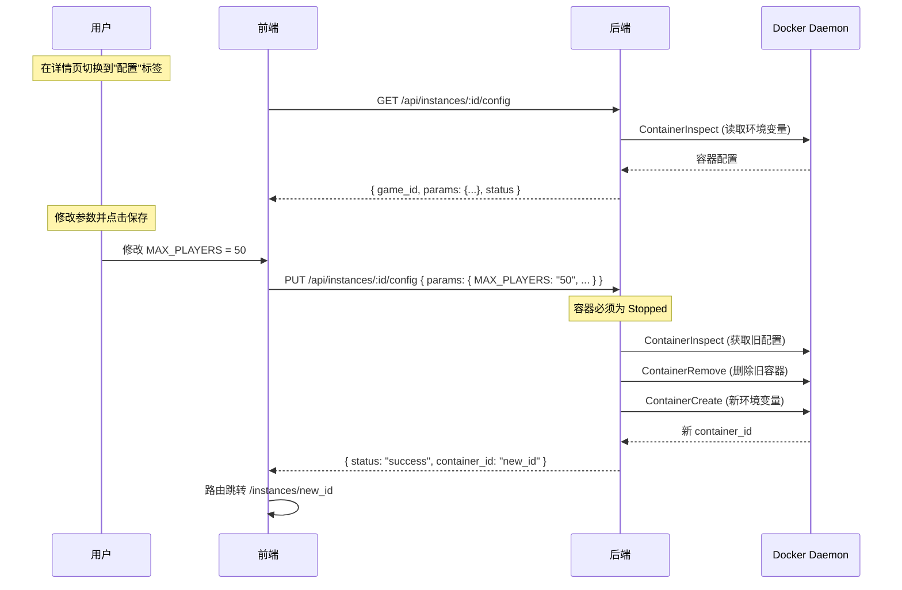

# 容器详情页 Tab 导航 + 在线配置修改

## 背景

当前容器详情页 (`/instances/:id`) 只有控制台终端视图。用户需要停止容器、通过命令行或外部工具才能修改运行参数（环境变量），操作门槛较高。

本计划实现：

1. 在容器详情页顶部添加 **Tab 导航栏**，包含"控制台"和"配置"两个标签页
2. 控制台标签页保持现有 xterm.js 终端功能不变
3. 新增**配置页**，展示容器当前生效的用户参数与端口映射，支持在线编辑并保存
4. 保存配置后，更新容器环境变量（需要容器处于 **Stopped** 状态，用户手动重启后生效，不提供一键重启）

## 需要评审的内容

> [!IMPORTANT]
> **配置修改的实现方式选型**
>
> Docker 不支持在运行中修改容器的环境变量。修改配置的标准做法是 **重建容器**：
>
> | 方案                           | 说明                                                         | 优缺点                                             |
> | ------------------------------ | ------------------------------------------------------------ | -------------------------------------------------- |
> | **Commit + Recreate**          | 将当前容器 commit 为临时镜像，用新环境变量重建容器           | 保留容器内文件改动，但 commit 成本高且污染镜像列表 |
> | **Remove + Create (保留卷)**   | 删除旧容器，用新环境变量创建新容器，挂载相同的 Volume        | 轻量、符合 Docker 最佳实践；卷数据完整保留         |
> | **仅允许 Stopped 修改 + 重建** | 只有容器停止后才能修改配置，修改后删除旧容器并用相同参数重建 | 最安全，无需担心运行态中断                         |
>
> 本计划采用 **方案 3 (仅允许 Stopped 修改 + 重建)**。原因：
>
> - 当前容器创建时已经将卷以 `minedock-{instanceName}-{volumeName}` 命名挂载，重建后可继续使用
> - Stopped 状态下修改避免用户在不知情的情况下丢失运行态数据
> - 实现最简洁，不引入 commit 等额外 Docker 操作

> [!WARNING]
> **重建容器会导致 container_id 变化**
>
> 由于是删除旧容器再创建新容器，container_id 会改变。需要：
>
> - 后端完成重建后返回新的 container_id
> - 前端路由跳转到新的 `/instances/:newId`
> - SQLite 中旧记录删除、新记录插入

> [!IMPORTANT]
> **配置项的数据来源**
>
> 容器环境变量有两个来源：
>
> 1. **模板固定环境变量** (`container.env`)：如 `EULA=TRUE`，这些是系统级必须值，**不允许用户修改**
> 2. **用户可调参数** (`params`)：如 `SERVER_TYPE`、`MAX_PLAYERS`，这些**允许用户修改**
>
> 配置页只展示和编辑 `params` 定义的参数，使用模板的 `params` 定义来渲染合适的输入控件（文本框、数字框、下拉框、开关等）。
>
> 为了实现这一点，需要：
>
> - 后端提供一个接口，返回容器当前生效的用户参数值
> - 后端提供一个接口，接收新参数值与端口映射并重建容器

> [!IMPORTANT]
> **端口映射编辑范围**
>
> 配置页允许编辑模板 `container.ports` 中定义端口对应的宿主机端口（host）。
>
> - 容器端口（container）和协议（protocol）来自模板定义，不允许在页面中新增或删除
> - 保存时后端将使用新端口映射重建容器

## 前端交互流程



## 拟定更改

### 后端 Model / 错误定义

#### [MODIFY] errors.go (`backend/internal/model/errors.go`)

新增领域错误：

```go
// ErrContainerNotStopped 表示容器必须处于停止状态才能执行此操作。
var ErrContainerNotStopped = errors.New("container must be stopped to update config")
```

#### [MODIFY] instance.go (`backend/internal/model/instance.go`)

扩展 Instance 结构体，增加 `GameID` 字段（用于查找原始模板）：

```go
type Instance struct {
    ContainerID string `json:"container_id"`
    Name        string `json:"name"`
    GameID      string `json:"game_id"`
    Status      string `json:"status"`
}
```

> [!NOTE]
> `GameID` 当前已在创建时通过 Docker Label (`minedock.game_id`) 存储，但未持久化到 SQLite 的 `instances` 表。本计划需要在读取实例时从 Docker Label 中回填此字段。

---

### 后端 Store 层

#### [MODIFY] sqlite.go (`backend/internal/store/sqlite.go`)

- `instances` 表新增 `game_id` 列（可选，允许空字符串兜底）
- `Save` 方法写入 `game_id`
- `Get` 方法读出 `game_id`

---

### 后端 Service 层

#### [MODIFY] docker_service.go (`backend/internal/service/docker_service.go`)

新增两个方法：

```go
// GetInstanceConfig 读取容器当前生效的用户可调参数。
// 通过 ContainerInspect 读取环境变量，结合模板 params 定义进行反向映射。
func (s *DockerService) GetInstanceConfig(ctx context.Context, containerID string) (*InstanceConfig, error) {
    // 1. ContainerInspect 获取容器 labels 和环境变量
    // 2. 从 labels 中取 game_id
    // 3. 加载对应模板，获取 params 定义
    // 4. 遍历 params 定义，从容器环境变量中提取当前值
    // 5. 返回 InstanceConfig
}

// UpdateInstanceConfig 通过重建容器来应用新的用户参数。
// 要求容器处于 Stopped 状态。
func (s *DockerService) UpdateInstanceConfig(ctx context.Context, containerID string, newParams map[string]string) (string, error) {
    // 1. ContainerInspect 确认容器为 Stopped
    // 2. 从 labels 取 game_id、name
    // 3. 加载模板并 mergeTemplateEnv(tpl, newParams) 生成新环境变量
    // 4. 记录旧容器的 HostConfig (端口映射、卷挂载) ← 直接从 inspect 拿
    // 5. ContainerRemove 删除旧容器
    // 6. ContainerCreate 创建新容器（相同镜像、名称 label、卷、端口，新环境变量）
    // 7. Store.Delete(oldID) + Store.Save(newInst)
    // 8. 返回新的 container_id
}
```

新增返回结构体：

```go
// InstanceConfig 描述容器当前生效的可编辑配置。
type InstanceConfig struct {
    GameID string            `json:"game_id"`
    Status string            `json:"status"`
    Params map[string]string `json:"params"`
}
```

> [!NOTE]
> `InstanceConfig.Params` 的 key 是模板 `params[].key`（如 `SERVER_TYPE`），value 是当前容器中该参数的实际值。这样前端拿到模板定义 + 当前值即可渲染编辑表单。

---

### 后端 API 层

#### [NEW] config_handler.go (`backend/internal/api/config_handler.go`)

新增 ConfigHandler：

```go
// InstanceConfigurator 定义配置 Handler 依赖的业务能力。
type InstanceConfigurator interface {
    GetInstanceConfig(ctx context.Context, containerID string) (*service.InstanceConfig, error)
    UpdateInstanceConfig(ctx context.Context, containerID string, params map[string]string) (string, error)
}

// ConfigHandler 暴露容器配置的 HTTP 处理器。
type ConfigHandler struct {
    cfg InstanceConfigurator
}

// NewConfigHandler 创建 ConfigHandler。
func NewConfigHandler(cfg InstanceConfigurator) *ConfigHandler { ... }

// HandleGetConfig 处理 GET /api/instances/{id}/config。
func (h *ConfigHandler) HandleGetConfig(w http.ResponseWriter, r *http.Request) {
    // 1. 解析容器 ID
    // 2. 调用 cfg.GetInstanceConfig()
    // 3. JSON 返回 InstanceConfig
}

// HandleUpdateConfig 处理 PUT /api/instances/{id}/config。
func (h *ConfigHandler) HandleUpdateConfig(w http.ResponseWriter, r *http.Request) {
    // 1. 解析容器 ID + JSON body { params: {...} }
    // 2. 调用 cfg.UpdateInstanceConfig()
    // 3. 返回 { status: "success", container_id: "new_id" }
}
```

#### [MODIFY] router.go (`backend/internal/api/router.go`)

- `NewRouter` 签名新增 `*ConfigHandler` 参数
- 注册路由：
  - `GET /api/instances/{id}/config`
  - `PUT /api/instances/{id}/config`

---

### 后端入口

#### [MODIFY] main.go

- 创建 `ConfigHandler`，注入 `DockerService`（它已实现 `InstanceConfigurator`）
- 更新 `NewRouter` 调用

```go
configHandler := api.NewConfigHandler(svc)
router := api.NewRouter(h, gameHandler, wsHandler, consoleHandler, configHandler)
```

---

### 前端 API 层

#### [MODIFY] index.ts (`frontend/src/api/index.ts`)

新增接口：

```typescript
export interface InstanceConfig {
  game_id: string;
  status: string;
  params: Record<string, string>;
}

export interface UpdateConfigResponse {
  status: string;
  container_id: string;
}

// 获取容器当前生效配置
export function getInstanceConfig(
  containerId: string,
): Promise<InstanceConfig> {
  return request<InstanceConfig>(
    `/instances/${encodeURIComponent(containerId)}/config`,
    { method: "GET" },
  );
}

// 更新容器配置（重建容器）
export function updateInstanceConfig(
  containerId: string,
  params: Record<string, string>,
): Promise<UpdateConfigResponse> {
  return request<UpdateConfigResponse>(
    `/instances/${encodeURIComponent(containerId)}/config`,
    {
      method: "PUT",
      body: { params },
    },
  );
}
```

---

### 前端视图层

#### [MODIFY] InstanceDetail.vue (`frontend/src/views/InstanceDetail.vue`)

这是本次改动最大的文件。主要变更：

1. 新增 Tab 导航栏，包含"控制台"和"配置"两个标签
2. 根据当前 Tab 显示对应的内容区域
3. Tab 切换时控制台的 xterm.js 连接保持/销毁逻辑

改造后的页面布局：

```text
┌─────────────────────────────────────────────┐
│ ← 返回        容器名称         状态指示器     │ ← 顶部导航栏
├──────────┬──────────┬───────────────────────┤
│  控制台   │   配置   │                       │ ← Tab 导航栏
├──────────┴──────────┴───────────────────────┤
│                                             │
│           Tab 内容区域                        │
│    (控制台: xterm.js / 配置: 参数编辑表单)     │
│                                             │
└─────────────────────────────────────────────┘
```

Tab 导航使用 `<nav>` + `<button>` 实现，不引入子路由。通过 `ref<'console' | 'config'>` 控制当前 Tab。

**样式规范**：

- Tab 按钮使用 CSS 变量 `--create-brass-primary` 保持 Create 主题一致性
- 激活 Tab 底部有高亮指示器（brass 色下划线）
- Tab 切换有 CSS transition 过渡

---

#### [NEW] InstanceConfig.vue (`frontend/src/views/InstanceConfig.vue`)

新增配置编辑组件（作为 InstanceDetail.vue 的子组件引入）:

**职责**：

- 接收 `containerId` prop
- 调用 `getInstanceConfig()` 获取当前配置
- 调用 `getGameTemplate(gameId)` 获取参数定义（label、type、options 等）
- 渲染参数编辑表单：
  - `string` → 文本输入框
  - `number` → 数字输入框
  - `boolean` → 开关/切换按钮
  - `select` → 下拉选择框
- 保存按钮调用 `updateInstanceConfig()`
- 容器运行中时显示提示"需要先停止容器才能修改配置"，表单禁用
- 保存成功后通过 `emit('reconfigured', newContainerId)` 通知父组件刷新路由

**视觉设计**：

```text
┌─────────────────────────────────────────┐
│ ⚙ 服务器配置                             │
│                                         │
│ ┌─ 服务器类型 ─────────────────────────┐ │
│ │ [Paper           ▾]                 │ │
│ │ 选择 Minecraft 服务器内核            │ │
│ └─────────────────────────────────────┘ │
│                                         │
│ ┌─ 游戏版本 ──────────────────────────┐ │
│ │ [LATEST                           ] │ │
│ │ 指定 Minecraft 版本号              │ │
│ └─────────────────────────────────────┘ │
│                                         │
│ ┌─ 最大玩家数 ────────────────────────┐ │
│ │ [20                               ] │ │
│ │ 服务器最大在线人数                  │ │
│ └─────────────────────────────────────┘ │
│                                         │
│ ┌─ 正版验证 ──────────────────────────┐ │
│ │ [●───────○]  开启                   │ │
│ │ 是否启用 Mojang 正版验证            │ │
│ └─────────────────────────────────────┘ │
│                                         │
│              [ 保存配置 ]                │
│                                         │
│ ⚠ 保存后需要重新启动容器才能生效        │
└─────────────────────────────────────────┘
```

---

### 前端 i18n

#### [MODIFY] zh-CN.json / en-US.json (`frontend/src/locales/`)

新增 key：

```json
{
  "tabs": {
    "console": "控制台 / Console",
    "config": "配置 / Config"
  },
  "config": {
    "title": "服务器配置 / Server Config",
    "save": "保存配置 / Save Config",
    "saving": "保存中... / Saving...",
    "saveSuccess": "配置已更新，容器已重建 / Config updated, container recreated",
    "mustStopFirst": "需要先停止容器才能修改配置 / Stop the container before editing config",
    "noTemplate": "无法加载模板信息 / Unable to load template",
    "restartNote": "保存后需要重新启动容器才能生效 / Restart the container after saving to apply changes"
  },
  "errors": {
    "containerNotStopped": "容器必须处于停止状态 / Container must be stopped"
  }
}
```

---

### 文档

#### [MODIFY] contracts.md (`docs/api/contracts.md`)

新增两个 HTTP 接口文档：

```markdown
### GET /api/instances/:id/config

- 说明：获取容器当前生效的用户可调参数
- 状态码：
  - 成功：`200`
  - 失败：`400`（ID 非法）、`500`
- 返回结果：

{ "game_id": "minecraft-java", "status": "Stopped", "params": { "SERVER_TYPE": "PAPER", "MAX_PLAYERS": "20" } }

### PUT /api/instances/:id/config

- 说明：更新容器配置参数（通过重建容器实现，容器必须为 Stopped）
- 状态码：
  - 成功：`200`
  - 失败：`400`（ID/参数非法）、`409`（容器运行中）、`500`
- 请求参数：

{ "params": { "SERVER_TYPE": "FABRIC", "MAX_PLAYERS": "50" } }

- 返回结果：

{ "status": "success", "container_id": "new_container_id" }
```

#### [MODIFY] instance_lifecycle.md (`docs/design-docs/instance_lifecycle.md`)

补充配置修改的策略说明：

- 配置修改通过重建容器实现
- 仅允许 Stopped 状态下修改
- 卷挂载保留，端口映射保留
- container_id 变更

#### [MODIFY] frontend.md (`docs/standards/frontend.md`)

路由部分无需修改（配置页不新增路由，作为 Tab 子视图）。

---

## 执行步骤

- [x] 后端 Model 层
  - [x] `model/errors.go`：新增 `ErrContainerNotStopped`
  - [x] `model/instance.go`：`Instance` 结构体增加 `GameID` 字段
- [x] 后端 Store 层
  - [x] `store/sqlite.go`：`instances` 表增加 `game_id` 列、更新 Save/Get
- [x] 后端 Service 层
  - [x] `service/docker_service.go`：新增 `GetInstanceConfig` 方法
  - [x] `service/docker_service.go`：新增 `UpdateInstanceConfig` 方法（重建容器逻辑）
  - [x] 确保 `ListInstances` 和 `readInstance` 回填 `GameID`
- [x] 后端 API 层
  - [x] 新建 `api/config_handler.go`：实现 `HandleGetConfig` 和 `HandleUpdateConfig`
  - [x] 修改 `api/router.go`：注册新路由、更新 `NewRouter` 签名
- [x] 后端入口
  - [x] 修改 `main.go`：创建 ConfigHandler 并注入
- [x] 前端 API 层
  - [x] 修改 `api/index.ts`：新增 `InstanceConfig` 类型与请求函数
- [x] 前端视图层
  - [x] 修改 `views/InstanceDetail.vue`：添加 Tab 导航栏，控制台/配置 Tab 切换
  - [x] 新建 `views/InstanceConfig.vue`：配置编辑表单组件（参数 + 端口映射）
- [x] 前端 i18n
  - [x] 修改 `locales/zh-CN.json`：新增 tabs / config 相关文案
  - [x] 修改 `locales/en-US.json`：新增 tabs / config 相关文案
- [x] 后端测试
  - [x] 编写 `GetInstanceConfig` 单元测试
  - [x] 编写 `UpdateInstanceConfig` 单元测试（Stopped 成功 / Running 失败 / 参数非法）
  - [x] 运行 `task backend:test && task backend:vet && task backend:lint`
- [x] 前端检查
  - [x] 运行 `npm run lint`
- [x] 文档更新
  - [x] 修改 `docs/api/contracts.md`：新增 GET/PUT config 接口文档
  - [x] 修改 `docs/design-docs/instance_lifecycle.md`：补充配置修改策略
- [ ] 集成验证
  - [ ] 创建 Minecraft Java 实例，进入详情页验证 Tab 切换
  - [ ] 停止容器后修改参数并保存，验证容器重建成功
  - [ ] 验证重建后 container_id 变更、路由跳转正确
  - [ ] 验证卷挂载保留，数据不丢失
  - [ ] 验证运行中容器的配置页表单为禁用状态

## 已确认结论

> [!IMPORTANT]
> **不支持"应用并重启"一键操作（本期）**
>
> 本期范围仅支持"保存配置（重建容器）"，保存后由用户手动启动容器使配置生效。
>
> "保存并重启"属于后续可选增强项，不纳入本计划实现。

> [!IMPORTANT]
> **Container ID 变更后的竞态确认**
>
> 结论：当前方案下不存在影响正确性的竞态。
>
> 依据：
>
> - `useInstanceSync` 当前仅在 `ContainerList` 页面挂载，详情页不依赖该 WebSocket 推送驱动刷新
> - 配置更新成功后由接口返回新 `container_id`，前端再路由跳转到 `/instances/:newId`
> - 详情页在路由参数变化时会主动执行 `fetchInstances`，以最新列表重新匹配实例
>
> 说明：网络较慢时可能出现短暂 loading/未找到提示，但会被后续拉取结果覆盖，不会造成最终状态错误。

## 验证计划

### 自动化测试

- `task backend:test` — 覆盖：
  - `GetInstanceConfig`：正常读取 / 容器不存在 / 模板不存在
  - `UpdateInstanceConfig`：Stopped 时成功重建 / Running 时拒绝 / 参数非法
  - `ConfigHandler`：HTTP 状态码映射
- `task backend:vet && task backend:lint`
- 前端：`npm run lint`

### 手动验证

- 创建 Minecraft Java 实例
- 进入详情页，验证 Tab 导航栏正确展示"控制台"和"配置"两个标签
- 切换到"配置"标签，验证当前参数值正确显示
- 容器运行中时，验证配置表单为禁用状态，显示提示信息
- 停止容器，验证配置表单变为可编辑
- 修改 MAX_PLAYERS 为 50，点击保存
- 验证保存成功提示、路由跳转到新 container_id
- 验证保存后容器保持 Stopped（不会自动启动）
- 启动容器，进入控制台验证新参数已生效
- 浏览器刷新后，验证配置页数据持久化正确
