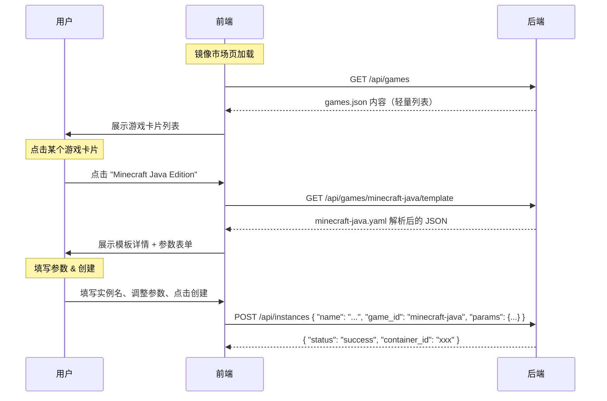

# 基于 YAML 的游戏模板规范设计

## 背景

当前 MineDock 使用 `registry.json` 作为静态镜像注册表，以 JSON 平铺方式定义游戏服务器的基础信息（镜像名、默认环境变量、默认端口）。随着项目演进，该方案暴露出以下局限性：

- **表达力不足**：无法描述卷挂载、资源限制（CPU/内存）、健康检查、启动命令覆盖等容器高级配置
- **用户可定制性差**：`default_env` 和 `default_ports` 虽然预留了字段，但创建流程中没有暴露用户定制入口；用户创建实例时无法调整任何参数
- **可读性与可维护性**：JSON 不支持注释，游戏模板作为面向运维/高级用户的配置文件，缺少自文档化能力
- **扩展性受限**：新增字段需要改动 Go 结构体、JSON 文件和前端类型定义三处，耦合度高

本计划采用 **两层架构** 替代现有方案：

1. **游戏目录层（`games.json`）**：轻量级游戏索引，包含 ID、名称、分类、图标等展示信息，供列表页快速加载
2. **模板详情层（`templates/*.yaml`）**：每个游戏对应一份 YAML 模板文件，包含完整的容器配置和用户可定制参数，按需加载

这种分离实现了：列表页秒开（只读小 JSON）、详情页按需获取（仅在用户点入具体游戏时加载 YAML）、模板可独立迭代。

## 需要评审的内容

> [!IMPORTANT]
> **API Breaking Change**
>
> 本计划引入两个新 API 并替代原有端点：
>
> - `GET /api/registry/images` → 替换为 `GET /api/games`（返回轻量目录）
> - 新增 `GET /api/games/:id/template`（按需返回单个模板详情）
> - `POST /api/instances` 请求体从 `{ "name": "xxx", "image_id": "xxx" }` 扩展为 `{ "name": "xxx", "game_id": "xxx", "params": { ... } }`
> - 旧的 `image_id` 字段将被 `game_id` 替代

> [!IMPORTANT]
> **两层数据存储**
>
> 从单个 `registry.json` 迁移为：
>
> - `games.json` — 游戏目录索引（JSON，保留快速读取和简单编辑的优势）
> - `templates/` 目录 — 每个游戏一个 YAML 文件（支持注释、结构化复杂配置）
>
> `games.json` 中每条记录的 `id` 与 `templates/{id}.yaml` 文件名一一对应。

> [!WARNING]
> **向后兼容性**
>
> 本次变更不做向后兼容。已有的通过 `image_id` 创建的容器实例不受影响（它们已存在于 Docker 和 SQLite 中），但新创建流程将使用 `game_id`。建议在合并前同步完成前端适配。

## 数据架构设计

### 文件组织

```text
backend/
├── games.json                     # 游戏目录索引（替代 registry.json）
├── templates/                     # YAML 模板目录
│   ├── minecraft-java.yaml
│   ├── minecraft-bedrock.yaml
│   └── terraria.yaml
```

### 第一层：games.json（游戏目录）

轻量级 JSON 文件，前端列表页一次性加载，仅包含展示所需的最小信息集：

```json
[
  {
    "id": "minecraft-java",
    "name": "Minecraft Java Edition",
    "description": "最流行的 Minecraft Java 版服务器，支持原版/Forge/Fabric/Paper 等多种模组加载器。",
    "category": "minecraft",
    "icon": "minecraft-java"
  },
  {
    "id": "minecraft-bedrock",
    "name": "Minecraft Bedrock Edition",
    "description": "Minecraft 基岩版服务器，支持手机/主机/Win10 跨平台联机。",
    "category": "minecraft",
    "icon": "minecraft-bedrock"
  },
  {
    "id": "terraria",
    "name": "Terraria",
    "description": "Terraria 专用服务器，支持 tShock 管理。",
    "category": "sandbox",
    "icon": "terraria"
  }
]
```

**字段说明：**

| 字段          | 类型   | 必填 | 说明                                            |
| ------------- | ------ | ---- | ----------------------------------------------- |
| `id`          | string | ✅   | 唯一标识，同时对应 `templates/{id}.yaml` 文件名 |
| `name`        | string | ✅   | 前端展示名称                                    |
| `description` | string | ✅   | 简要说明                                        |
| `category`    | string | ✅   | 游戏分类（如 `minecraft`、`sandbox`）           |
| `icon`        | string | ✅   | 图标标识（前端用于匹配图标资源）                |

### 第二层：YAML 模板（按需加载）

用户在列表页点入某个游戏后，前端请求 `GET /api/games/:id/template` 获取该游戏的完整模板配置。

#### 模板 Schema 定义

```yaml
# Docker 镜像配置
image:
  name: "itzg/minecraft-server" # 镜像名称（必填，不含 tag）
  tag: "latest" # 镜像标签（选填，默认 latest）

# 容器运行配置
container:
  # 端口映射（选填）
  ports:
    - host: 25565
      container: 25565
      protocol: "tcp" # tcp | udp，默认 tcp

  # 环境变量（选填）
  env:
    EULA: "TRUE"
    TYPE: "PAPER"

  # 卷挂载（选填）
  volumes:
    - name: "server-data" # 卷标识（用于生成唯一卷名）
      container_path: "/data" # 容器内挂载路径（必填）
      readonly: false # 是否只读（选填，默认 false）

  # 资源限制（选填）
  resources:
    memory: "2g" # 内存上限（Docker 格式：512m, 1g, 2g）
    cpu: 2.0 # CPU 核数上限

  # 启动命令覆盖（选填）
  # command: ["java", "-jar", "server.jar"]

  # 健康检查（选填）
  health_check:
    test: ["CMD-SHELL", "mc-health"] # 检查命令
    interval: "30s" # 检查间隔
    timeout: "10s" # 超时
    retries: 3 # 重试次数
    start_period: "60s" # 启动等待

# 用户可定制参数（选填）
# 用户创建实例时可以覆盖的配置项
params:
  - key: "SERVER_TYPE" # 参数键
    label: "服务器类型" # 前端显示名称
    description: "选择 Minecraft 服务器内核"
    type: "select" # 参数类型：string | number | boolean | select
    default: "PAPER" # 默认值
    options: # type 为 select 时的可选项
      - value: "PAPER"
        label: "Paper"
      - value: "FABRIC"
        label: "Fabric"
      - value: "FORGE"
        label: "Forge"
      - value: "VANILLA"
        label: "Vanilla"
    env_var: "TYPE" # 映射到的环境变量名（选填，默认等于 key）
```

> [!NOTE]
> 注意 YAML 模板中**不再包含** `meta`（name / description / category / icon）信息——这些展示字段已在 `games.json` 中定义，避免重复维护。模板仅关注技术配置（镜像、容器、参数）。

### 完整示例

#### minecraft-java.yaml

```yaml
image:
  name: "itzg/minecraft-server"
  tag: "latest"

container:
  ports:
    - host: 25565
      container: 25565
      protocol: "tcp"
  env:
    EULA: "TRUE"
    TYPE: "PAPER"
  volumes:
    - name: "server-data"
      container_path: "/data"
  resources:
    memory: "2g"
    cpu: 2.0
  health_check:
    test: ["CMD-SHELL", "mc-health"]
    interval: "30s"
    timeout: "10s"
    retries: 3
    start_period: "120s"

params:
  - key: "SERVER_TYPE"
    label: "服务器类型"
    description: "选择 Minecraft 服务器内核"
    type: "select"
    default: "PAPER"
    options:
      - value: "PAPER"
        label: "Paper"
      - value: "FABRIC"
        label: "Fabric"
      - value: "FORGE"
        label: "Forge"
      - value: "VANILLA"
        label: "Vanilla"
    env_var: "TYPE"
  - key: "MC_VERSION"
    label: "游戏版本"
    description: "指定 Minecraft 版本号"
    type: "string"
    default: "LATEST"
    env_var: "VERSION"
  - key: "MAX_PLAYERS"
    label: "最大玩家数"
    description: "服务器最大在线人数"
    type: "number"
    default: 20
    env_var: "MAX_PLAYERS"
  - key: "ONLINE_MODE"
    label: "正版验证"
    description: "是否启用 Mojang 正版验证"
    type: "boolean"
    default: true
    env_var: "ONLINE_MODE"
```

#### minecraft-bedrock.yaml

```yaml
image:
  name: "itzg/minecraft-bedrock-server"
  tag: "latest"

container:
  ports:
    - host: 19132
      container: 19132
      protocol: "udp"
  env:
    EULA: "TRUE"
  volumes:
    - name: "server-data"
      container_path: "/data"
  resources:
    memory: "1g"
    cpu: 1.0

params:
  - key: "GAMEMODE"
    label: "游戏模式"
    description: "服务器默认游戏模式"
    type: "select"
    default: "survival"
    options:
      - value: "survival"
        label: "生存"
      - value: "creative"
        label: "创造"
      - value: "adventure"
        label: "冒险"
    env_var: "GAMEMODE"
  - key: "DIFFICULTY"
    label: "难度"
    description: "服务器难度"
    type: "select"
    default: "normal"
    options:
      - value: "peaceful"
        label: "和平"
      - value: "easy"
        label: "简单"
      - value: "normal"
        label: "普通"
      - value: "hard"
        label: "困难"
    env_var: "DIFFICULTY"
```

#### terraria.yaml

```yaml
image:
  name: "ryshe/terraria"
  tag: "latest"

container:
  ports:
    - host: 7777
      container: 7777
      protocol: "tcp"
  volumes:
    - name: "world-data"
      container_path: "/root/.local/share/Terraria/Worlds"
  resources:
    memory: "1g"
    cpu: 1.0

params:
  - key: "WORLD_SIZE"
    label: "世界大小"
    description: "新建世界的尺寸"
    type: "select"
    default: "2"
    options:
      - value: "1"
        label: "小"
      - value: "2"
        label: "中"
      - value: "3"
        label: "大"
  - key: "MAX_PLAYERS"
    label: "最大玩家数"
    description: "服务器最大在线人数"
    type: "number"
    default: 8
```

### 前端交互流程



## 拟定更改

### 数据文件

#### [NEW] games.json (`backend/games.json`)

游戏目录索引文件（替代 `registry.json`），包含三个初始游戏条目。

#### [NEW] templates/ 目录 (`backend/templates/`)

创建模板目录，包含三个初始 YAML 模板文件：

- `minecraft-java.yaml`
- `minecraft-bedrock.yaml`
- `terraria.yaml`

#### [DELETE] registry.json (`backend/registry.json`)

迁移完成后删除旧的注册表文件。

---

### 后端 Model 层

#### [NEW] game.go (`backend/internal/model/game.go`)

新增游戏目录模型（轻量索引）：

```go
// Game 描述游戏目录中的一个条目（轻量展示信息）。
type Game struct {
    ID          string `json:"id"`
    Name        string `json:"name"`
    Description string `json:"description"`
    Category    string `json:"category"`
    Icon        string `json:"icon"`
}
```

#### [MODIFY] registry.go → template.go (`backend/internal/model/template.go`)

重命名文件，定义 YAML 模板数据模型（不含 meta 展示信息）：

```go
// GameTemplate 描述一个游戏服务器的完整技术配置模板。
type GameTemplate struct {
    Image     TemplateImage   `json:"image"     yaml:"image"`
    Container ContainerConfig `json:"container" yaml:"container"`
    Params    []TemplateParam `json:"params"    yaml:"params"`
}

// TemplateImage Docker 镜像配置。
type TemplateImage struct {
    Name string `json:"name" yaml:"name"`
    Tag  string `json:"tag"  yaml:"tag"`
}

// FullImageRef 返回完整的镜像引用（name:tag）。
func (i TemplateImage) FullImageRef() string { ... }

// ContainerConfig 容器运行配置。
type ContainerConfig struct {
    Ports       []PortMapping      `json:"ports"                  yaml:"ports"`
    Env         map[string]string  `json:"env"                    yaml:"env"`
    Volumes     []VolumeMount      `json:"volumes"                yaml:"volumes"`
    Resources   *ResourceLimits    `json:"resources,omitempty"    yaml:"resources"`
    Command     []string           `json:"command,omitempty"      yaml:"command"`
    HealthCheck *HealthCheckConfig `json:"health_check,omitempty" yaml:"health_check"`
}

// PortMapping 端口映射配置。
type PortMapping struct {
    Host      int    `json:"host"      yaml:"host"`
    Container int    `json:"container" yaml:"container"`
    Protocol  string `json:"protocol"  yaml:"protocol"`
}

// VolumeMount 卷挂载配置。
type VolumeMount struct {
    Name          string `json:"name"           yaml:"name"`
    ContainerPath string `json:"container_path" yaml:"container_path"`
    ReadOnly      bool   `json:"readonly"       yaml:"readonly"`
}

// ResourceLimits 资源限制配置。
type ResourceLimits struct {
    Memory string  `json:"memory" yaml:"memory"`
    CPU    float64 `json:"cpu"    yaml:"cpu"`
}

// HealthCheckConfig 健康检查配置。
type HealthCheckConfig struct {
    Test        []string `json:"test"         yaml:"test"`
    Interval    string   `json:"interval"     yaml:"interval"`
    Timeout     string   `json:"timeout"      yaml:"timeout"`
    Retries     int      `json:"retries"      yaml:"retries"`
    StartPeriod string   `json:"start_period" yaml:"start_period"`
}

// TemplateParam 用户可定制参数定义。
type TemplateParam struct {
    Key         string        `json:"key"                   yaml:"key"`
    Label       string        `json:"label"                 yaml:"label"`
    Description string        `json:"description"           yaml:"description"`
    Type        string        `json:"type"                  yaml:"type"`
    Default     any           `json:"default"               yaml:"default"`
    Options     []ParamOption `json:"options,omitempty"      yaml:"options"`
    EnvVar      string        `json:"env_var,omitempty"     yaml:"env_var"`
}

// ParamOption select 类型参数的可选项。
type ParamOption struct {
    Value string `json:"value" yaml:"value"`
    Label string `json:"label" yaml:"label"`
}
```

#### [MODIFY] errors.go (`backend/internal/model/errors.go`)

```go
// ErrImageNotFound → 重命名
var ErrGameNotFound = errors.New("game not found")

// ErrTemplateNotFound 对应的模板文件不存在。
var ErrTemplateNotFound = errors.New("template not found")

// ErrTemplateInvalid 模板校验失败。
var ErrTemplateInvalid = errors.New("invalid template")
```

---

### 后端 Service 层

#### [MODIFY] registry_service.go → game_service.go (`backend/internal/service/game_service.go`)

重命名并重构为两层加载逻辑：

```go
// GameService 提供游戏目录查询和模板按需加载能力。
type GameService struct {
    games       []model.Game
    gameMap     map[string]model.Game
    templateDir string  // YAML 模板目录路径
}

// NewGameService 从 games.json 加载游戏目录，并记录模板目录路径。
// 启动时仅校验 games.json 的合法性和每个 game ID 对应的 YAML 文件是否存在。
func NewGameService(gamesFilePath string, templateDirPath string) (*GameService, error) { ... }

// ListGames 返回游戏目录（轻量列表）。
func (s *GameService) ListGames(_ context.Context) []model.Game { ... }

// GetGame 按 ID 查找游戏条目。
func (s *GameService) GetGame(_ context.Context, id string) (model.Game, error) { ... }

// GetTemplate 按游戏 ID 加载并返回对应的 YAML 模板。
// 每次调用都从文件系统读取并解析（保证看到最新文件内容）。
func (s *GameService) GetTemplate(_ context.Context, id string) (model.GameTemplate, error) { ... }
```

> [!NOTE]
> `GetTemplate` 计为每次调用都读取文件（而非启动时缓存全部模板）。原因：
>
> - 模板文件数量有限（通常 < 20），单文件解析开销极小
> - 允许运维人员热更模板文件无需重启后端
> - 如果后续性能分析发现瓶颈，可以轻松加一层 `sync.Map` 缓存

#### [MODIFY] docker_service.go (`backend/internal/service/docker_service.go`)

- `ImageRegistry` 接口替换为 `GameRegistry` 接口：

```go
// GameRegistry 定义 DockerService 依赖的游戏与模板查询能力。
type GameRegistry interface {
    GetGame(ctx context.Context, id string) (model.Game, error)
    GetTemplate(ctx context.Context, id string) (model.GameTemplate, error)
}
```

- `CreateInstance` 签名变更：`CreateInstance(ctx, name, gameID string, params map[string]string)`
  - 先调用 `GetGame` 确认 game 存在
  - 再调用 `GetTemplate` 获取完整模板
  - **严格校验 params**：遍历用户传入的 params，若 key 不在模板 `params` 定义中，返回 `400` 拒绝（防止拼写错误导致参数静默失效）
  - 合并合法 params 到模板默认环境变量
  - **本期仅传入** `Image`、`Env`、`Labels` 到 `ContainerCreate`；端口映射、卷挂载、资源限制、健康检查等高级容器配置留作下一期实现（YAML 中定义但暂不生效）

---

### 后端 API 层

#### [MODIFY] registry_handlers.go → game_handlers.go (`backend/internal/api/game_handlers.go`)

```go
// GameLister 定义游戏目录 Handler 依赖的查询操作。
type GameLister interface {
    ListGames(ctx context.Context) []model.Game
    GetTemplate(ctx context.Context, id string) (model.GameTemplate, error)
}

// GameHandler 暴露游戏目录与模板相关 HTTP 处理器。
type GameHandler struct {
    games GameLister
}

// NewGameHandler 创建 GameHandler。
func NewGameHandler(g GameLister) *GameHandler { ... }

// GetGames 处理 GET /api/games，返回游戏目录列表。
func (h *GameHandler) GetGames(w http.ResponseWriter, r *http.Request) { ... }

// GetGameTemplate 处理 GET /api/games/{id}/template，按需返回模板详情。
func (h *GameHandler) GetGameTemplate(w http.ResponseWriter, r *http.Request) { ... }
```

#### [MODIFY] handlers.go (`backend/internal/api/handlers.go`)

- `createRequest` 字段变更：

```go
type createRequest struct {
    Name   string            `json:"name"`
    GameID string            `json:"game_id"`
    Params map[string]string `json:"params"`
}
```

- `InstanceService` 接口的 `CreateInstance` 签名同步更新：`CreateInstance(ctx, name, gameID string, params map[string]string)`
- `mapErrorCode` 更新：`ErrImageNotFound` → `ErrGameNotFound`、新增 `ErrTemplateNotFound` → `500`、`ErrTemplateInvalid` → `500`

#### [MODIFY] router.go (`backend/internal/api/router.go`)

- 删除 `GET /api/registry/images`
- 新增 `GET /api/games`
- 新增 `GET /api/games/{id}/template`
- 更新 `NewRouter` 签名和参数

---

### 后端入口

#### [MODIFY] main.go

- `MINEDOCK_REGISTRY_PATH` → `MINEDOCK_GAMES_PATH`（游戏目录文件路径，默认 `games.json`）
- 新增 `MINEDOCK_TEMPLATES_DIR`（模板文件目录，默认 `templates`）
- `NewRegistryService(path)` → `NewGameService(gamesPath, templatesDir)`
- 注入链路同步更新

---

### 后端依赖

#### [MODIFY] go.mod

- 新增依赖：`gopkg.in/yaml.v3`

---

### 前端 API 层

#### [MODIFY] index.ts (`frontend/src/api/index.ts`)

- `RegistryImage` 类型重命名为 `Game`（轻量目录条目）
- 新增 `GameTemplate`、`TemplateParam`、`ParamOption` 等类型定义
- `listRegistryImages()` → `listGames()`
- 新增 `getGameTemplate(id: string)` API 函数
- `createInstance(name, imageId)` → `createInstance(name, gameId, params?)`

---

### 前端状态管理

#### [MODIFY] registry.ts → games.ts (`frontend/src/stores/games.ts`)

重命名并重构 store：

```typescript
// games store 管理游戏目录和当前选中模板
export const useGameStore = defineStore('games', () => {
  const games = ref<Game[]>([])                      // 游戏目录列表
  const currentTemplate = ref<GameTemplate | null>(null)  // 当前查看的模板
  const loading = ref(false)

  // 加载游戏目录（列表页用）
  async function fetchGames() { ... }

  // 按需加载指定游戏的模板详情（点入详情时调用）
  async function fetchTemplate(gameId: string) { ... }

  // 按 ID 查找游戏条目
  function getGameById(id: string) { ... }

  return { games, currentTemplate, loading, fetchGames, fetchTemplate, getGameById }
})
```

#### [MODIFY] containers.ts (`frontend/src/stores/containers.ts`)

- `create(name, imageId)` → `create(name, gameId, params?)`

---

### 前端路由

#### [MODIFY] router/index.ts (`frontend/src/router/index.ts`)

- `/registry` 路由保持不变（游戏列表页）

---

### 文档

#### [MODIFY] contracts.md (`docs/api/contracts.md`)

- 删除 `GET /api/registry/images`
- 新增 `GET /api/games` 文档（返回游戏目录列表）
- 新增 `GET /api/games/:id/template` 文档（返回模板详情）
- 更新 `POST /api/instances` 请求体：`image_id` → `game_id`，新增 `params`

#### [MODIFY] instance_lifecycle.md (`docs/design-docs/instance_lifecycle.md`)

- Instance 结构体中 `ImageID` 更新为 `GameID` 说明

#### [MODIFY] directory.md (`docs/standards/directory.md`)

- 新增 `templates/` 目录说明
- 注释 `games.json` 用途

---

## 执行步骤

- [ ] 后端依赖
  - [ ] 执行 `go get gopkg.in/yaml.v3`，更新 `go.mod` 和 `go.sum`
- [ ] 数据文件
  - [ ] 编写 `backend/games.json`（三个游戏条目）
  - [ ] 创建 `backend/templates/` 目录
  - [ ] 编写 `templates/minecraft-java.yaml`
  - [ ] 编写 `templates/minecraft-bedrock.yaml`
  - [ ] 编写 `templates/terraria.yaml`
- [ ] 后端 Model 层
  - [ ] 新建 `backend/internal/model/game.go`，定义 `Game` 结构体
  - [ ] 新建 `backend/internal/model/template.go`（替代 `registry.go`），定义 `GameTemplate` 及相关结构体
  - [ ] 修改 `backend/internal/model/errors.go`：新增 `ErrGameNotFound`、`ErrTemplateNotFound`、`ErrTemplateInvalid`，删除 `ErrImageNotFound`
  - [ ] 删除 `backend/internal/model/registry.go`
- [ ] 后端 Service 层
  - [ ] 新建 `backend/internal/service/game_service.go`（替代 `registry_service.go`），实现 JSON 目录加载 + YAML 按需解析
  - [ ] 编写 `game_service_test.go` 单元测试
    - [ ] `ListGames`：正常加载 / 空文件 / 格式错误
    - [ ] `GetTemplate`：正常解析 / 文件不存在 / YAML 格式错误 / 必填字段缺失
    - [ ] 启动校验：game ID 与 YAML 文件名的一致性检查
  - [ ] 修改 `docker_service.go`：`ImageRegistry` → `GameRegistry`、`CreateInstance` 支持 `gameID` + `params`
  - [ ] 删除 `registry_service.go` 和 `registry_service_test.go`
- [ ] 后端 API 层
  - [ ] 新建 `backend/internal/api/game_handlers.go`（替代 `registry_handlers.go`），实现 `GameHandler`
  - [ ] 修改 `handlers.go`：`createRequest` 适配 `game_id` + `params`，`InstanceService` 接口更新
  - [ ] 修改 `router.go`：删除 `/api/registry/images`，新增 `/api/games` 和 `/api/games/{id}/template`
  - [ ] 更新 `handlers_test.go`
  - [ ] 删除 `registry_handlers.go`
- [ ] 后端入口
  - [ ] 修改 `main.go`：环境变量、初始化链路、注入更新
- [ ] 前端适配
  - [ ] 修改 `frontend/src/api/index.ts`：类型定义和 API 函数更新
  - [ ] 重命名 `frontend/src/stores/registry.ts` → `games.ts`，实现两层加载逻辑
  - [ ] 修改 `frontend/src/stores/containers.ts`：`create` action 适配新签名
- [ ] 前端参数表单 UI
  - [ ] 实现动态参数表单组件（根据模板 `params` 定义渲染）
    - [ ] `string` 类型 → 文本输入框
    - [ ] `number` 类型 → 数字输入框
    - [ ] `boolean` 类型 → 开关/复选框
    - [ ] `select` 类型 → 下拉选择框（渲染 `options`）
  - [ ] 在创建实例流程中集成参数表单（用户点入游戏详情后展示）
  - [ ] 表单默认值从模板 `params[].default` 填充
  - [ ] 提交时将表单值收集为 `params` 对象传入 `POST /api/instances`
- [ ] 文档更新
  - [ ] 修改 `docs/api/contracts.md`：更新/新增 API 端点文档
  - [ ] 修改 `docs/design-docs/instance_lifecycle.md`：更新 `GameID` 字段
  - [ ] 修改 `docs/standards/directory.md`：新增 `templates/` 和 `games.json` 说明
- [ ] 清理
  - [ ] 删除 `backend/registry.json`
  - [ ] 全局搜索 `registry` / `image_id` / `RegistryImage` 残留引用，确保全部迁移

## 已确认的决策

- ✅ **params 参数合并策略**：采用严格模式——用户传入的 `params` 中若存在模板未定义的 key，返回 `400` 拒绝，防止拼写错误导致参数静默失效
- ✅ **卷/资源/端口映射**：本期不生效。YAML 模板中可以定义 `volumes`、`resources`、`ports`、`health_check` 等字段（数据结构已就绪），但 `CreateInstance` 本期仅传入 `Image`、`Env`、`Labels`，高级容器配置留作下一期实现
- ✅ **前端参数表单 UI**：本期包含。前端需根据模板 `params` 动态渲染参数表单（`string` → 输入框、`number` → 数字框、`boolean` → 开关、`select` → 下拉框），集成到创建实例流程中

## 验证计划

### 自动化测试

- `task backend:test` — 覆盖：
  - `GameService.ListGames`：正常 / 空 / 错误 JSON
  - `GameService.GetTemplate`：正常 YAML / 文件不存在 / 格式错误 / 必填字段缺失
  - `GameService` 启动校验：game ID 对应 YAML 不存在时报错
  - `DockerService.CreateInstance`（mock）：有效 gameID、无效 gameID、参数合并
  - `Handler` 层：请求体解析与错误映射
- `task backend:vet && task backend:lint`
- 前端：`npm run lint`

### 手动验证

- 启动后端，调用 `GET /api/games`，验证返回轻量游戏列表（无模板配置信息）
- 调用 `GET /api/games/minecraft-java/template`，验证返回完整的模板详情（含 params、resources 等）
- 调用 `GET /api/games/not-exist/template`，验证返回 `404`
- 调用 `POST /api/instances` 传入 `game_id` + 合法 `params`，验证容器环境变量正确合并
- 调用 `POST /api/instances` 传入未知 param key，验证返回 `400`（严格校验）
- 修改 `templates/minecraft-java.yaml` 中某个默认值，不重启后端，调用 `GET /api/games/minecraft-java/template`，验证返回更新后的值（热更验证）
- 前端：点入游戏详情页，验证参数表单正确渲染（输入框 / 下拉框 / 开关），默认值正确填充
- 前端：调整参数后点击创建，验证请求体中 `params` 正确携带用户填写的值
